# @u1f992/vivliostyle-index

A [unified](https://github.com/unifiedjs/unified) plugin for generating indexes in [Vivliostyle CLI](https://github.com/vivliostyle/vivliostyle-cli) builds.

The indexing rules are based on Fujita (2019) and the Japan Science and Technology Agency (n.d.).

The default output follows and extends the index structure specified by the DAISY Consortium (n.d.). Its `data-index-role` vocabulary similarly draws on and extends the index terms defined by the EPUB 3 Structural Semantics Vocabulary 1.1 (Herman and Garrish 2026). The index is identified with the DPUB-ARIA `doc-index` role (Garrish and Siegman 2025).

## Concept

This plugin is built around a single idea: index construction is written as URLs. The pair of a path and a fragment uniquely identifies the target index, and the `?q=` query expresses the content to register. The query is written in a DSL with MakeIndex/upmendex-inspired syntax; the sections that follow describe its grammar.

The most basic example: in `chapter.md`,

```html
<span data-index="index.md?q=a!Apple#index">Apple</span>
```

and in `index.md`, in the same directory,

```html
<nav id="index" role="doc-index"></nav>
```

The reference is a relative URL resolved against the referring document. Its path and fragment resolve to the `<nav>` in `index.md` as the index to build; the element must carry the `doc-index` role. The query `a!Apple` registers the heading `Apple` in the group `a`, with the position of the `<span>` as its locator. The plugin fills the `<nav>` with the built index, and the entry links back to the `<span>`. A reference may also omit the path; it then resolves to its own document, so a document can host its own index.

As a consequence of this design, the query passes through two layers of encoding: the URL splits off the fragment, then the query decomposes into parameters. A character that is significant at either layer must be percent-encoded in the `q` value: `#` ends the query and starts the fragment ([query state](https://url.spec.whatwg.org/#query-state)), and within the query, `&` separates parameters, `+` denotes a space, and `%` introduces a percent-encoded byte ([`application/x-www-form-urlencoded` parsing](https://url.spec.whatwg.org/#urlencoded-parsing)) (WHATWG n.d.). For example, the instruction `a@A!ampersand@&|seealso{p@P!plus@+}` is written as:

```
index.md?q=a@A!ampersand@%26|seealso{p@P!plus@%2B}#index
```

A `sed` one-liner applies the same rewrite to arbitrary input:

```shellsession
$ echo 'a!ampersand@&|seealso{p!plus@+}' | sed 's/%/%25/g; s/#/%23/g; s/&/%26/g; s/+/%2B/g'
a!ampersand@%26|seealso{p!plus@%2B}
```

<!-- The URLSearchParams serializer is also an exact inverse of the query parsing, but it over-encodes: every character outside its safe set becomes %xx. -->

## Instruction metasyntax

An indexing reference carries its instruction in the `q` parameter of its `data-index` attribute. The instruction is the percent-decoded value of `q`. It is split into tokens before parsing: at each position the longest matching lexeme wins, and every character that matches no lexeme is literal text.

| Token | Role |
| --- | --- |
| `!` | Separates the group, heading, and subheading of an address |
| `@` | Separates a reading and its display value within a heading |
| `\|` | Introduces a template |
| `\|(` | Marks a range start |
| `\|)` | Marks a range end |
| `\|see{` | Opens the target of a preferred cross-reference |
| `\|seealso{` | Opens the target of a related cross-reference |
| `}` | Closes a cross-reference target |

### Escaping

A backslash makes the next character literal text. Exactly `\`, `@`, `!`, `|`, `(`, `)`, `{`, and `}` can be escaped; a backslash before any other character is a syntax error.

An escaped character never participates in token matching, so escaping any one character of a multi-character lexeme keeps the whole sequence literal: `\|see{` spells the text `|see{`, and inside a template introduced by `|`, `see\{` spells the text `see{`.

`(`, `)`, and `{` are not tokens on their own and may appear unescaped in literal text; they are escapable so that an author can break up the `|`-prefixed lexemes and the cross-reference closer.

### Accepted instructions

The diagram below shows every token path that ends in an accepted instruction. Transitions are labeled with tokens. `text` is any text token: a maximal run of literal characters, or one escaped character. A transition into a final state means the input ends there, so an instruction is accepted exactly when the input runs out in a state that has such a transition. The path taken determines the instruction type: through `range start` or `range end` a range boundary, through `cross-reference target` a cross-reference, and otherwise a page reference.

```mermaid
stateDiagram-v2
    direction TB

    state "address" as address {
        direction TB
        state "group" as a_g
        state "group reading" as a_gr
        state "group @" as a_ga
        state "group display" as a_gd
        state "heading" as a_h
        state "heading reading" as a_hr
        state "heading @" as a_ha
        state "heading display" as a_hd
        state "subheading" as a_s
        state "subheading reading" as a_sr
        state "subheading @" as a_sa
        state "subheading display" as a_sd
        [*] --> a_g
        a_g --> a_gr : text
        a_gr --> a_gr : text
        a_gr --> a_ga : @
        a_ga --> a_gd : text
        a_gd --> a_gd : text
        a_gr --> a_h : !
        a_gd --> a_h : !
        a_h --> a_hr : text
        a_hr --> a_hr : text
        a_hr --> a_ha : @
        a_ha --> a_hd : text
        a_hd --> a_hd : text
        a_hr --> a_s : !
        a_hd --> a_s : !
        a_s --> a_sr : text
        a_sr --> a_sr : text
        a_sr --> a_sa : @
        a_sa --> a_sd : text
        a_sd --> a_sd : text
        a_hr --> [*]
        a_hd --> [*]
        a_sr --> [*]
        a_sd --> [*]
    }

    state "cross-reference target" as target {
        direction TB
        state "group" as t_g
        state "group reading" as t_gr
        state "group @" as t_ga
        state "group display" as t_gd
        state "heading" as t_h
        state "heading reading" as t_hr
        state "heading @" as t_ha
        state "heading display" as t_hd
        state "subheading" as t_s
        state "subheading reading" as t_sr
        state "subheading @" as t_sa
        state "subheading display" as t_sd
        [*] --> t_g
        t_g --> t_gr : text
        t_gr --> t_gr : text
        t_gr --> t_ga : @
        t_ga --> t_gd : text
        t_gd --> t_gd : text
        t_gr --> t_h : !
        t_gd --> t_h : !
        t_h --> t_hr : text
        t_hr --> t_hr : text
        t_hr --> t_ha : @
        t_ha --> t_hd : text
        t_hd --> t_hd : text
        t_hr --> t_s : !
        t_hd --> t_s : !
        t_s --> t_sr : text
        t_sr --> t_sr : text
        t_sr --> t_sa : @
        t_sa --> t_sd : text
        t_sd --> t_sd : text
        t_hr --> [*]
        t_hd --> [*]
        t_sr --> [*]
        t_sd --> [*]
    }

    state "range start" as range_start
    state "range end" as range_end
    state "target closed" as xref_closed
    state "template" as template

    [*] --> address
    address --> [*]
    address --> template : |
    address --> range_start : |(
    address --> range_end : |)
    address --> target : |see{
    address --> target : |seealso{
    range_start --> [*]
    range_start --> template : |
    range_end --> [*]
    target --> xref_closed : }
    xref_closed --> [*]
    xref_closed --> template : |
    template --> template : text
    template --> [*]
```



## References

- DAISY Consortium. n.d. “[Indexes](https://kb.daisy.org/publishing/docs/html/indexes.html).” *Accessible Publishing Knowledge Base*. Accessed August 18, 2026. Revision history: [publishing/docs/html/indexes.html](https://github.com/DAISY/kb/commits/main/publishing/docs/html/indexes.html).
- Fujita, Setsuko. 2019. *[本の索引の作り方](http://www.chijinshokan.co.jp/Books/ISBN978-4-8052-0932-5.htm)*. 地人書館.
- Garrish, Matt, and Tzviya Siegman, eds. 2025. “[`doc-index`](https://www.w3.org/TR/dpub-aria-1.1/#doc-index).” *Digital Publishing WAI-ARIA Module 1.1*. W3C Recommendation, June 12, 2025. World Wide Web Consortium. Revision history: [dpub-aria/index.html](https://github.com/w3c/aria/commits/main/dpub-aria/index.html).
- Herman, Ivan, and Matt Garrish, eds. 2026. “[Indexes](https://www.w3.org/TR/epub-ssv/#h_indexes).” *EPUB 3 Structural Semantics Vocabulary 1.1*. W3C Group Note, May 28, 2026. World Wide Web Consortium. Revision history: [wg-notes/ssv/index.html](https://github.com/w3c/epub-specs/commits/main/wg-notes/ssv/index.html).
- Japan Science and Technology Agency. n.d. “[SIST 13 索引作成](https://warp.ndl.go.jp/20220119/20220113214526id_/jipsti.jst.go.jp/sist/handbook/sist13/sist13_m.htm) [Indexes and Indexing].” Archived January 13, 2022, by the National Diet Library Web Archiving Project. Accessed August 18, 2026. <!-- Last known Wayback Machine snapshot of the SIST site: https://web.archive.org/web/20220302192615/jipsti.jst.go.jp/sist/index.html -->
- WHATWG. n.d. “[URL](https://url.spec.whatwg.org/).” *WHATWG Living Standard*. Accessed August 19, 2026. Revision history: [url.bs](https://github.com/whatwg/url/commits/main/url.bs).
