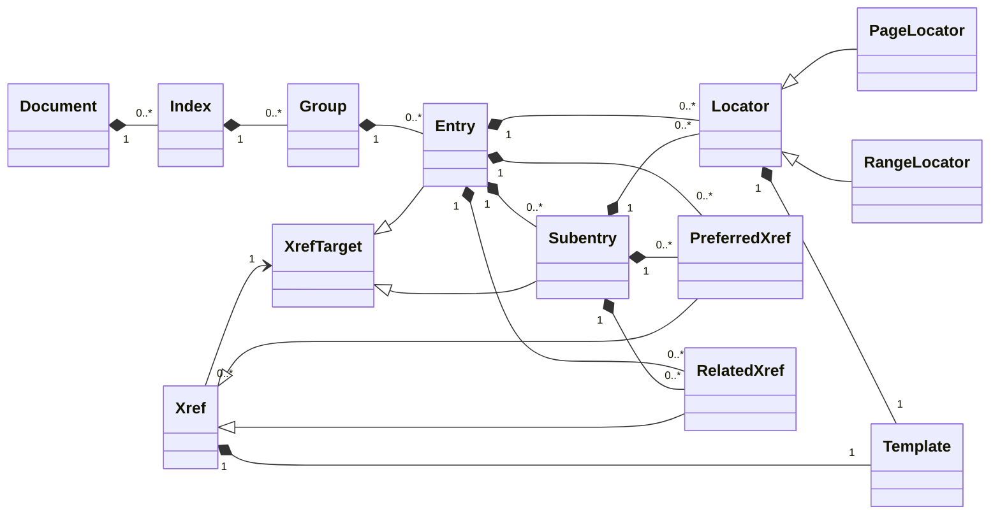

# @u1f992/vivliostyle-index

A [unified](https://github.com/unifiedjs/unified) plugin for generating indexes in [Vivliostyle CLI](https://github.com/vivliostyle/vivliostyle-cli) builds.

The indexing rules are based on the Japan Science and Technology Agency's SIST 13 (n.d.); Fujita (2019) provides an abridged commentary on it.

The default output follows and extends the index structure specified by the DAISY Consortium (n.d.). The plugin's `data-index-role` vocabulary similarly draws on and extends the index terms defined by the EPUB 3 Structural Semantics Vocabulary 1.1 (Herman and Garrish 2026). Index targets carry the DPUB-ARIA `doc-index` role (Garrish and Siegman 2025).

## Concept

This plugin encodes index-building instructions in URLs. A path-and-fragment pair uniquely identifies an index target, while the `q` query parameter contains the instruction. The instruction uses a DSL inspired by MakeIndex and upmendex; the following sections define its grammar.

See [the basic example configuration](examples/basic/vivliostyle.config.ts) for the required plugin setup. After configuring the plugin, add the following reference to `chapter.md`:

```html
<span data-index="index.md?q=a!Apple#index">Apple</span>
```

In `index.md` in the same directory, provide the target navigation element:

```html
<nav id="index" role="doc-index"></nav>
```

The `data-index` value is a relative URL resolved against the document that contains it. Its path and fragment identify the `<nav>` in `index.md` as the index target; that element must carry the `doc-index` role. The instruction `a!Apple` registers the entry `Apple` in the group `a`, using the position of the `<span>` as its locator. The plugin fills the `<nav>` with the built index, and the generated locator links back to the `<span>`. If the `<span>` has no `id`, the plugin assigns one for this link. If a reference omits the path, its target is resolved within the referring document, allowing a document to host its own index.

As a consequence of this design, the `q` value is interpreted at two syntactic layers: first as part of a URL, then as an `application/x-www-form-urlencoded` query parameter. For a uniform reversible encoding, percent-encode `#`, `&`, `+`, and `%` in a raw instruction before placing it in `q`.

At the URL layer, `#` ends the query and starts the fragment ([query state](https://url.spec.whatwg.org/#query-state)). During query parsing, `&` separates parameters, `+` denotes a space, and a `%` followed by two ASCII hexadecimal digits introduces a percent-encoded byte ([`application/x-www-form-urlencoded` parsing](https://url.spec.whatwg.org/#urlencoded-parsing)) (WHATWG n.d.). Encoding every `%` prevents a sequence in the raw instruction from being decoded accidentally. For example, the instruction `a@A!ampersand@&|seealso{p@P!plus@+}` is written as:

```
index.md?q=a@A!ampersand@%26|seealso{p@P!plus@%2B}#index
```

The following `sed` command percent-encodes those four characters in a raw instruction:

```shellsession
$ printf '%s\n' 'a@A!ampersand@&|seealso{p@P!plus@+}' | sed 's/%/%25/g; s/#/%23/g; s/&/%26/g; s/+/%2B/g'
a@A!ampersand@%26|seealso{p@P!plus@%2B}
```

## Index modeling

A document contains zero or more indexes. Each index contains zero or more groups, and each group contains zero or more entries (Japanese: 「主見出し」). An entry contains zero or more locators (Japanese: 「所在指示」), preferred cross-references (`see`; Japanese: 「を見よ参照」), related cross-references (`see also`; Japanese: 「をも見よ参照」), and subentries (Japanese: 「副見出し」). A subentry has the same locator and cross-reference collections as an entry, but cannot contain further subentries.

Locators distinguish single pages from page ranges. Modeling every locator as a range would require the renderer to collapse equal endpoints into a single-page form.[^locator-css] A cross-reference targets either an entry or a subentry. Each locator and cross-reference also has an HTML template, primarily used to wrap its rendered form in decorative markup.

[^locator-css]: CSS cross-reference functions such as [`target-counter()`](https://drafts.csswg.org/css-content-3/#target-counter) and [`target-text()`](https://drafts.csswg.org/css-content-3/#target-text) retrieve information from one target at a time. They provide no conditional mechanism for comparing two range endpoints and collapsing the output when both resolve to the same page.

The following class diagram summarizes these relationships.



The implementation keys each index by the path-and-fragment pair of its output target; together they identify a DOM element. Each group, entry, and subentry key is a pair of `reading` and `html` values. In the DSL, this pair is written as `reading@display`; the display value becomes the key's inner HTML. A cross-reference identifies its target by the group and entry keys, plus the subentry key when present.

## Instruction syntax

An indexing reference carries its instruction in the `q` parameter of its `data-index` attribute. The instruction is the decoded value returned for `q` after parsing the URL query, including `+`-to-space conversion and percent-decoding. The lexer scans the decoded instruction from left to right. A backslash starts an escape; otherwise, the lexer selects the longest recognized token at each position and treats unmatched characters as literal text.

| Token | Role |
| --- | --- |
| `!` | Separates the group, entry, and optional subentry of an address |
| `@` | Separates a reading from its display value within a group, entry, or subentry |
| `\|` | Introduces a template |
| `\|(` | Marks a range start |
| `\|)` | Marks a range end |
| `\|see{` | Opens the target of a preferred cross-reference |
| `\|seealso{` | Opens the target of a related cross-reference |
| `}` | Closes a cross-reference target |

### Escaping

A backslash makes the next character literal text. Only `\`, `@`, `!`, `|`, `(`, `)`, `{`, and `}` can be escaped; a backslash before any other character is a syntax error.

An escaped character never participates in token matching. Escaping the leading `|` makes an entire `|`-prefixed sequence literal: `\|see{` spells the text `|see{`. Escaping a later character instead can cause the leading `|` to match the standalone template introducer; for example, `|see\{` introduces a template containing `see{`.

`(`, `)`, and `{` are not tokens on their own, but escaping them can prevent `|(`, `|)`, `|see{`, or `|seealso{` from matching. Escape `}` when it should be text rather than a cross-reference closer.

### Accepted instructions

Common instruction forms are shown below.

| Form | Example |
| --- | --- |
| Page | `a!Apple` |
| Range start | `a!Apple|(` |
| Range end | `a!Apple|)` |
| Preferred cross-reference | `a!Apple|see{b!Banana}` |
| Related cross-reference | `a!Apple|seealso{b!Banana}` |
| Template | `a!Apple|<strong><slot></slot></strong>` |

The diagram below shows every token sequence that forms an accepted instruction. Token-consuming transitions are labeled with tokens. Here, `text` means either a maximal run of literal characters or one escaped character. An unlabeled transition to `[*]` indicates that the instruction may end in the source state; an instruction is accepted only if all input has been consumed in such a state. A path through `range start` or `range end` represents a range boundary; one through `cross-reference target` represents a cross-reference; any other accepted path represents a page reference.

```mermaid
stateDiagram-v2
    direction TB

    state "address" as address {
        direction TB
        state "group" as a_g
        state "group reading" as a_gr
        state "group @" as a_ga
        state "group display" as a_gd
        state "entry" as a_e
        state "entry reading" as a_er
        state "entry @" as a_ea
        state "entry display" as a_ed
        state "subentry" as a_s
        state "subentry reading" as a_sr
        state "subentry @" as a_sa
        state "subentry display" as a_sd
        [*] --> a_g
        a_g --> a_gr : text
        a_gr --> a_gr : text
        a_gr --> a_ga : @
        a_ga --> a_gd : text
        a_gd --> a_gd : text
        a_gr --> a_e : !
        a_gd --> a_e : !
        a_e --> a_er : text
        a_er --> a_er : text
        a_er --> a_ea : @
        a_ea --> a_ed : text
        a_ed --> a_ed : text
        a_er --> a_s : !
        a_ed --> a_s : !
        a_s --> a_sr : text
        a_sr --> a_sr : text
        a_sr --> a_sa : @
        a_sa --> a_sd : text
        a_sd --> a_sd : text
        a_er --> [*]
        a_ed --> [*]
        a_sr --> [*]
        a_sd --> [*]
    }

    state "cross-reference target" as target {
        direction TB
        state "group" as t_g
        state "group reading" as t_gr
        state "group @" as t_ga
        state "group display" as t_gd
        state "entry" as t_e
        state "entry reading" as t_er
        state "entry @" as t_ea
        state "entry display" as t_ed
        state "subentry" as t_s
        state "subentry reading" as t_sr
        state "subentry @" as t_sa
        state "subentry display" as t_sd
        [*] --> t_g
        t_g --> t_gr : text
        t_gr --> t_gr : text
        t_gr --> t_ga : @
        t_ga --> t_gd : text
        t_gd --> t_gd : text
        t_gr --> t_e : !
        t_gd --> t_e : !
        t_e --> t_er : text
        t_er --> t_er : text
        t_er --> t_ea : @
        t_ea --> t_ed : text
        t_ed --> t_ed : text
        t_er --> t_s : !
        t_ed --> t_s : !
        t_s --> t_sr : text
        t_sr --> t_sr : text
        t_sr --> t_sa : @
        t_sa --> t_sd : text
        t_sd --> t_sd : text
        t_er --> [*]
        t_ed --> [*]
        t_sr --> [*]
        t_sd --> [*]
    }

    state "range start" as range_start
    state "range end" as range_end
    state "target closed" as xref_closed
    state "template" as template

    [*] --> address
    address --> [*]
    address --> template : |
    address --> range_start : |(
    address --> range_end : |)
    address --> target : |see{
    address --> target : |seealso{
    range_start --> [*]
    range_start --> template : |
    range_end --> [*]
    target --> xref_closed : }
    xref_closed --> [*]
    xref_closed --> template : |
    template --> template : text
    template --> [*]
```



## References

- DAISY Consortium. n.d. “[Indexes](https://kb.daisy.org/publishing/docs/html/indexes.html).” *Accessible Publishing Knowledge Base*. Accessed August 18, 2026. Revision history: [publishing/docs/html/indexes.html](https://github.com/DAISY/kb/commits/main/publishing/docs/html/indexes.html).
- Fujita, Setsuko. 2019. *[本の索引の作り方](http://www.chijinshokan.co.jp/Books/ISBN978-4-8052-0932-5.htm)*. 地人書館.
- Garrish, Matt, and Tzviya Siegman, eds. 2025. “[`doc-index`](https://www.w3.org/TR/dpub-aria-1.1/#doc-index).” *Digital Publishing WAI-ARIA Module 1.1*. W3C Recommendation, June 12, 2025. World Wide Web Consortium. Revision history: [dpub-aria/index.html](https://github.com/w3c/aria/commits/main/dpub-aria/index.html).
- Herman, Ivan, and Matt Garrish, eds. 2026. “[Indexes](https://www.w3.org/TR/epub-ssv/#h_indexes).” *EPUB 3 Structural Semantics Vocabulary 1.1*. W3C Group Note, May 28, 2026. World Wide Web Consortium. Revision history: [wg-notes/ssv/index.html](https://github.com/w3c/epub-specs/commits/main/wg-notes/ssv/index.html).
- Japan Science and Technology Agency. n.d. “[SIST 13 索引作成](https://warp.ndl.go.jp/20220119/20220113214526id_/jipsti.jst.go.jp/sist/handbook/sist13/sist13_m.htm) [Indexes and Indexing].” Archived January 13, 2022, by the National Diet Library Web Archiving Project. Accessed August 18, 2026.
- WHATWG. n.d. “[URL](https://url.spec.whatwg.org/).” *WHATWG Living Standard*. Accessed August 19, 2026. Revision history: [url.bs](https://github.com/whatwg/url/commits/main/url.bs).
